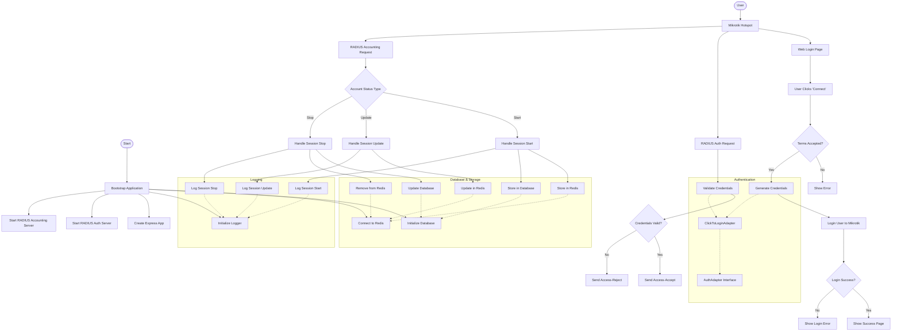

# Hotspot RADIUS Application Flow Diagram

```mermaid
graph TB
    %% Main application flow
    Start([Start]) --> Bootstrap[Bootstrap Application]
    Bootstrap --> DB[Initialize Database]
    Bootstrap --> Redis[Connect to Redis]
    Bootstrap --> Logger[Initialize Logger]
    Bootstrap --> Express[Create Express App]
    Bootstrap --> RADIUS_Auth[Start RADIUS Auth Server]
    Bootstrap --> RADIUS_Acct[Start RADIUS Accounting Server]
    
    %% User flow through Mikrotik and web UI
    User([User]) --> Mikrotik[Mikrotik Hotspot]
    Mikrotik --> WebUI[Web Login Page]
    WebUI --> Connect[User Clicks 'Connect']
    Connect --> Terms{Terms Accepted?}
    Terms -->|No| ShowError[Show Error]
    Terms -->|Yes| GenerateCredsWeb[Generate Credentials]
    GenerateCredsWeb --> LoginMikrotik[Login User to Mikrotik]
    LoginMikrotik --> LoginSuccess{Login Success?}
    LoginSuccess -->|Yes| SuccessPage[Show Success Page]
    LoginSuccess -->|No| LoginError[Show Login Error]
    
    %% RADIUS auth flow
    Mikrotik --> RADIUS_Auth_Req[RADIUS Auth Request]
    RADIUS_Auth_Req --> Validate[Validate Credentials]
    Validate --> Valid{Credentials Valid?}
    Valid -->|Yes| SendAccept[Send Access-Accept]
    Valid -->|No| SendReject[Send Access-Reject]
    
    %% RADIUS accounting flow
    Mikrotik --> RADIUS_Acct_Req[RADIUS Accounting Request]
    RADIUS_Acct_Req --> AcctType{Account Status Type}
    AcctType -->|Start| SessionStart[Handle Session Start]
    AcctType -->|Update| SessionUpdate[Handle Session Update]
    AcctType -->|Stop| SessionStop[Handle Session Stop]
    SessionStart --> StoreRedis[Store in Redis]
    SessionStart --> StoreDB[Store in Database]
    SessionUpdate --> UpdateRedis[Update in Redis]
    SessionStop --> UpdateDB[Update Database]
    SessionStop --> CleanRedis[Remove from Redis]
    
    %% Data flow
    SessionStart --> LogStart[Log Session Start]
    SessionUpdate --> LogUpdate[Log Session Update]
    SessionStop --> LogStop[Log Session Stop]
    
    %% Components
    subgraph "Authentication"
        ClickToLoginAdapter[ClickToLoginAdapter]
        AuthAdapter[AuthAdapter Interface]
        ClickToLoginAdapter -.-> AuthAdapter
        GenerateCredsWeb -.-> ClickToLoginAdapter
        Validate -.-> ClickToLoginAdapter
    end
    
    subgraph "Database & Storage"
        Redis
        DB
        StoreRedis -.-> Redis
        UpdateRedis -.-> Redis
        CleanRedis -.-> Redis
        StoreDB -.-> DB
        UpdateDB -.-> DB
    end
    
    subgraph "Logging"
        Logger
        LogStart -.-> Logger
        LogUpdate -.-> Logger
        LogStop -.-> Logger
    end
```