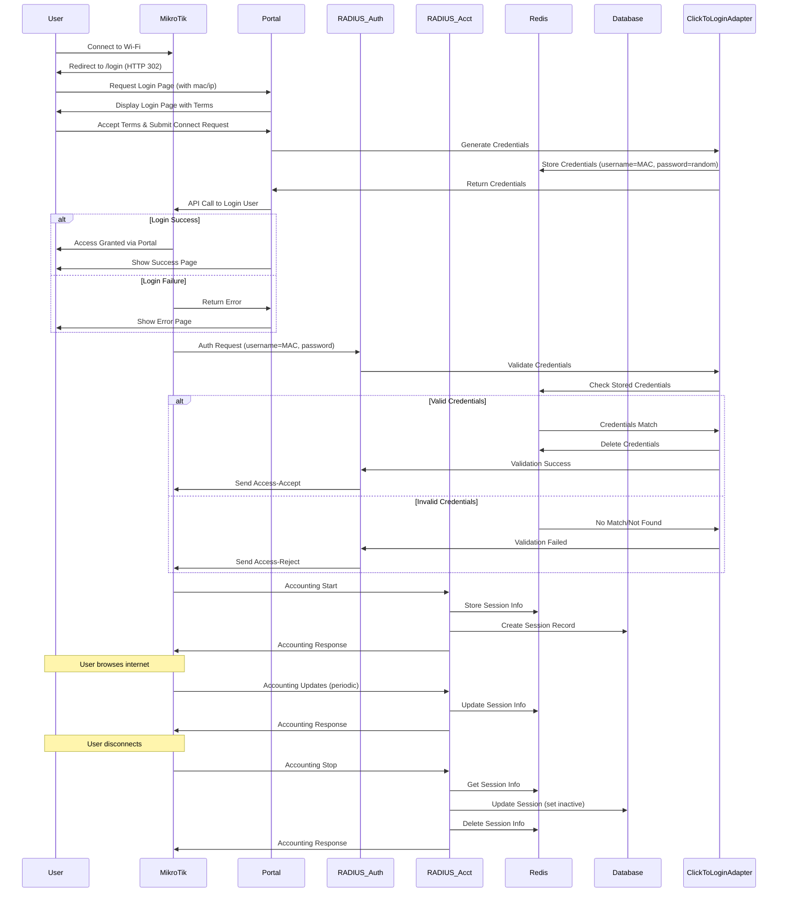

# Hotspot Login Flow

```mermaid
sequenceDiagram
    participant User
    participant MikroTik
    participant Portal
    participant RADIUS_Auth
    participant RADIUS_Acct
    participant Redis
    participant Database

    %% Initial Connection
    User->>MikroTik: Connect to Wi-Fi
    MikroTik->>User: Redirect to /login (HTTP 302)
    User->>Portal: Request Login Page (with mac/ip)
    
    %% Login Page Flow
    Portal->>User: Display Login Page with Terms
    User->>Portal: Accept Terms & Submit Connect Request
    
    %% Auth Flow
    Portal->>ClickToLoginAdapter: Generate Credentials
    ClickToLoginAdapter->>Redis: Store Credentials (username=MAC, password=random)
    ClickToLoginAdapter->>Portal: Return Credentials
    Portal->>MikroTik: API Call to Login User
    
    alt Login Success
        MikroTik->>User: Access Granted via Portal
        Portal->>User: Show Success Page
    else Login Failure
        MikroTik->>Portal: Return Error
        Portal->>User: Show Error Page
    end
    
    %% RADIUS Auth Flow
    MikroTik->>RADIUS_Auth: Auth Request (username=MAC, password)
    RADIUS_Auth->>ClickToLoginAdapter: Validate Credentials
    ClickToLoginAdapter->>Redis: Check Stored Credentials
    
    alt Valid Credentials
        Redis->>ClickToLoginAdapter: Credentials Match
        ClickToLoginAdapter->>Redis: Delete Credentials
        ClickToLoginAdapter->>RADIUS_Auth: Validation Success
        RADIUS_Auth->>MikroTik: Send Access-Accept
    else Invalid Credentials
        Redis->>ClickToLoginAdapter: No Match/Not Found
        ClickToLoginAdapter->>RADIUS_Auth: Validation Failed
        RADIUS_Auth->>MikroTik: Send Access-Reject
    end
    
    %% RADIUS Accounting Flow
    MikroTik->>RADIUS_Acct: Accounting Start
    RADIUS_Acct->>Redis: Store Session Info
    RADIUS_Acct->>Database: Create Session Record
    RADIUS_Acct->>MikroTik: Accounting Response
    
    Note over User,MikroTik: User browses internet
    
    MikroTik->>RADIUS_Acct: Accounting Updates (periodic)
    RADIUS_Acct->>Redis: Update Session Info
    RADIUS_Acct->>MikroTik: Accounting Response
    
    Note over User,MikroTik: User disconnects
    
    MikroTik->>RADIUS_Acct: Accounting Stop
    RADIUS_Acct->>Redis: Get Session Info
    RADIUS_Acct->>Database: Update Session (set inactive)
    RADIUS_Acct->>Redis: Delete Session Info
    RADIUS_Acct->>MikroTik: Accounting Response
```